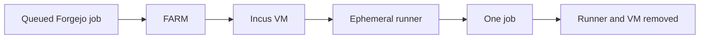

# FARM

FARM runs Forgejo Actions jobs in disposable Incus virtual machines. Each VM
registers one ephemeral runner, accepts at most one job, then is removed with
its runner registration.

FARM manages VMs, not containers. It supports repository, organization, user,
and global runner pools, with queue-based scaling and optional idle capacity.

**New to FARM?** [Run your first job](tutorial/first-job.md).

Already have a running controller? See the [how-to guides](how-to/index.md) or
look up a setting in the [configuration reference](reference/configuration.md).

The operations UI and API have no authentication. Keep the listener on loopback
or put an authenticated proxy in front of it.
